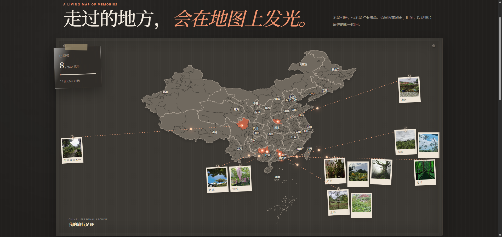
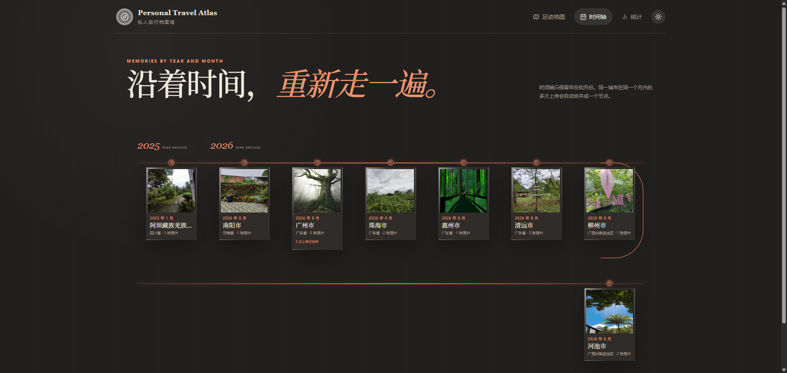
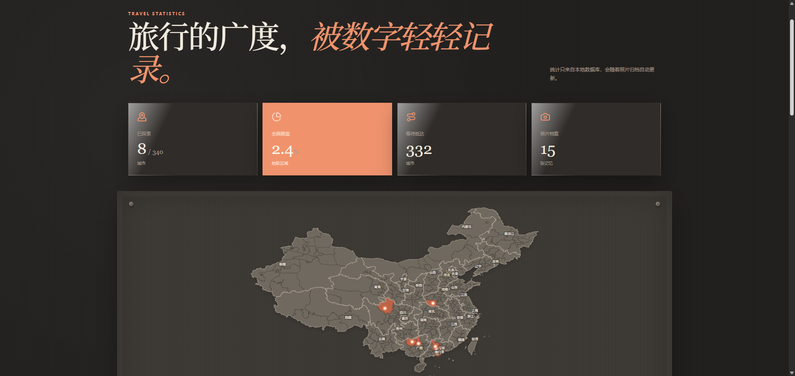

# Personal Travel Atlas

> 一个属于个人的中国旅行足迹数字地图：把城市、时间和照片整理成一面可以继续生长的旅行记忆墙。


Personal Travel Atlas 不是后台管理系统，也不是普通相册。它用米白纸张、档案票据、照片卡片、地图节点和回形针，把个人旅行记录做成一座可浏览的数字化旅行博物馆。

## 预览

当前版本包含深夜模式、全国地图、照片墙、己字形时间轴和统计视图。下面的截图来自本地真实运行页面。

<p align="center">
  
</p>

<p align="center">
  
  
</p>

## 功能概览

- 全国中国地图：大陆、港澳台和城市级状态展示
- 省份档案：全国首页先点击省份，再进入省级地图查看城市
- 城市档案：照片瀑布流、时间排序、大图预览和来源感知返回
- 本地批量上传：支持手动归档，并可读取 EXIF 拍摄时间与 GPS
- 照片墙封面：每座城市最多选择 3 张封面，也可以只点亮城市而不展示照片
- 照片墙布局：同城照片成组分布，可拖动并记忆位置，窗口缩放后保持锚点
- 时间轴：按年份和月份排序，同一城市同一个年月内的多次上传自动合并
- 全国统计：已探索城市、覆盖率、剩余城市、照片数量和省份排名
- 深夜模式：纸张档案风格、地图脉冲、页面转场和城市到照片的发光圆点流动
- 档案维护：支持批量删除照片，以及带确认的全量档案清空（原图先移动到本地 trash）

## 技术栈

- Next.js 16 App Router + React 19 + TypeScript
- Tailwind CSS 4（项目视觉样式集中在 `src/app/globals.css`）
- Framer Motion：地图、照片墙、时间轴和页面动画
- SQLite + Prisma 6：本地结构化数据
- 本地文件存储：`travel-data/photos`
- D3 Geo + 开源中国行政区 GeoJSON：地图投影和 SVG 交互
- Next.js Route Handlers：上传、照片、统计和档案 API

Next.js 16 要求 Node.js 20.9 或更高版本。

## 本地运行

```powershell
npm.cmd install

# 从模板创建本机配置文件（.env 不会提交到 Git）
Copy-Item .env.example .env

npm.cmd run setup
npm.cmd run dev
```

默认访问 `http://localhost:3000`。如果 3000 端口被占用，可以使用：

```powershell
npm.cmd run dev -- -p 3210
```

生产预览：

```powershell
npm.cmd run build
npm.cmd run start -- -p 3210
```

常用检查命令：

```powershell
npm.cmd run lint
npm.cmd run build
```

### 新电脑安装排查

如果出现 `Environment variable not found: DATABASE_URL`，说明本机还没有 `.env`：

```powershell
Copy-Item .env.example .env
npx.cmd prisma db push
npm.cmd run db:seed
```

如果出现 `getaddrinfo ENOTFOUND binaries.prisma.sh`，说明 Prisma 引擎下载地址无法被当前网络解析。可以在当前 PowerShell 会话切换到镜像后重试：

```powershell
$env:PRISMA_ENGINES_MIRROR = "https://registry.npmmirror.com/-/binary/prisma"
npx.cmd prisma generate
npx.cmd prisma db push
npm.cmd run db:seed
```

也可以先检查网络：

```powershell
Resolve-DnsName binaries.prisma.sh
Test-NetConnection binaries.prisma.sh -Port 443
```

如果使用本地代理，请将代理的 HTTP 端口填入：

```powershell
$env:HTTPS_PROXY = "http://127.0.0.1:7890"
$env:HTTP_PROXY = $env:HTTPS_PROXY
npx.cmd prisma generate
```

地图同步完成但 Prisma 失败时，不需要重新下载地图，直接执行上面的 Prisma、数据库和 seed 命令即可。

## 目录结构

```text
src/
  app/
    page.tsx                         全国地图首页
    province/[id]/page.tsx           省级地图
    city/[id]/page.tsx               城市档案
    timeline/page.tsx                时间轴
    stats/page.tsx                   统计
    api/                              Next.js Route Handlers
    globals.css                      主题、地图和档案墙样式
  components/
    atlas-map.tsx                    地图、照片组、连线、拖动与光点
    city-photo-wall.tsx              城市照片墙和批量删除
    timeline-view.tsx                己字形时间轴
    upload-dialog.tsx                批量上传
    theme-toggle.tsx                 深夜模式切换
  lib/
    ...                              Prisma、EXIF 和地图数据服务
prisma/
  schema.prisma                      SQLite 数据模型
  seed.ts                            省份与城市基础数据
public/maps/                         地图 GeoJSON/JSON
travel-data/
  photos/                             本地原图，默认不进入 Git
  metadata/travel.db                 SQLite 数据库，默认不进入 Git
docs/screenshots/                    README 展示截图
PROJECT_CONTEXT.md                   后续 AI 接手用的完整项目文档
```

## 数据与隐私

应用默认是 local-first：照片和数据库都保存在本机。

- SQLite：`travel-data/metadata/travel.db`
- 原图：`travel-data/photos/{year}/{month}/`
- 清空档案备份：`travel-data/trash/archive-{timestamp}/`

`.gitignore` 已排除照片、数据库、地图同步产物、行政区索引和环境变量。上传 GitHub 前仍建议检查一次：

```powershell
git status --short --ignored
```

如果仓库设置为公开，README 中的截图也会公开；截图包含当前本地演示数据，请根据需要选择公开或私有仓库。

## 重要交互约定

1. 全国地图中省份作为整体点击，进入 `/province/{id}`；省级地图中才操作具体城市。
2. 首页照片墙只展示 `City.showOnWall=true` 且 `Photo.featured=true` 的照片。
3. 城市最多 3 张封面，星标操作即时保存，不需要额外保存按钮。
4. 城市详情页从全国地图进入时返回全国首页，从省级地图进入时返回对应省份。
5. 时间轴按 `cityId + year + month` 聚合，避免同一城市同月重复开节点。
6. 照片组位置使用浏览器 `localStorage` 的比例锚点保存，窗口缩放不会重新排列照片。

## 后续 AI 接手

开始改代码前，请先阅读 [PROJECT_CONTEXT.md](./PROJECT_CONTEXT.md)。该文档记录了当前架构、数据语义、API、交互约定、主题动画和验证基线。

后续扩展可以在不破坏当前照片模型的前提下增加：

- 世界地图和 `Country` 层级
- 旅行路线
- AI 旅行总结
- 照片 AI 分类

当前不包含 AI 功能；Phase 1、Phase 2 和不含 AI 的 Phase 3 视觉增强已经完成。

## 数据来源

行政区边界来自阿里云 DataV 开放地理数据接口。运行 `npm.cmd run map:sync` 后，地图数据会保存到本地，应用运行时不依赖外部地图服务。
